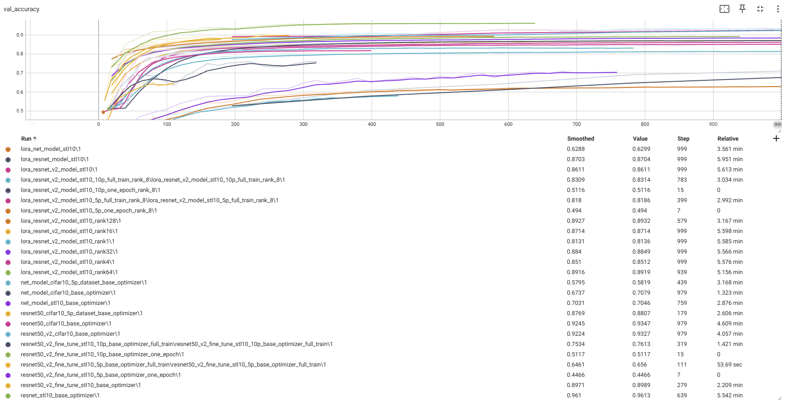

# Uploaded tensorboard logs and checkpoints to [Google Drive](https://drive.google.com/file/d/13yYxejBc9C6WCFMYoM9ZdNa96tkT1RR7/view?usp=drive_link)

# Train Loss


# val Loss


# val accuracy


# val accuracy of lora


```
resnet (full train) - 0.955
resnet (5% dataset) - 0.88

netmodel (full train) - 0.826

kd resnet->netmodel (full train, 0.5/0.5 loss) - 0.828
kd resnet->netmodel (full train, 0.3/0.7 loss) - 0.834
kd resnet->netmodel (full train, 0.3/0.7 loss, logit_std) - 0.8481

partialy training (proof that with kd model converges faster) -
netmodel (5% dataset, one epoch) -  0.2129
kd resnet->netmodel (5% dataset, one epoch) - 0.269

netmodel (10% dataset, one epoch) - 0.3277
kd resnet->netmodel (10% dataset, one epoch) - 0.3746

profit:
- vanila kd + 0.8%
- logit_std kd +2.21%
- faster convergence (at least +5%, with same number of iterations) - good if the dataset is not large
```


lora results:
```

resnet50 trained on cifar-10 - accuracy: 0.945, params=24.5M
validate resnet50 on stl-50  - accuracy: 0.408

fine-tune on stl-10 dataset  - accuracy: 0.88, params=24.5M
lora resnet50 on stl-10      - accuracy: 0.814, trainable params=3.6k, rank=1
lora resnet50 on stl-10      - accuracy: 0.851, trainable params=14.4k, rank=4
lora resnet50 on stl-10      - accuracy: 0.864, trainable params=28.7k, rank=8
lora resnet50 on stl-10      - accuracy: 0.872, trainable params=57.5k, rank=16
lora resnet50 on stl-10      - accuracy: 0.885, trainable params=115k, rank=32
lora resnet50 on stl-10      - accuracy: 0.892, trainable params=230k, rank=64
lora resnet50 on stl-10      - accuracy: 0.894, trainable params=460k, rank=128

fine-tune on stl-10 5% dataset     - accuracy: 0.656
fine-tune on stl-10 10% dataset    - accuracy: 0.7613

lora resnet50 on stl-10 5% dataset - accuracy: 0.819, rank=8
lora resnet50 on stl-10 10% dataset - accuracy: 0.831, rank=8

5% dataset = 250 images
10% dataset = 500 images
```