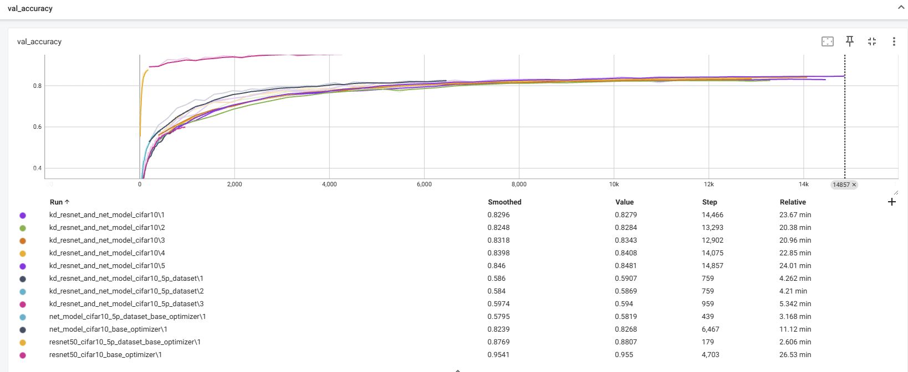

# Uploaded tensorboard logs and checkpoints to [Google Drive](https://drive.google.com/file/d/13yYxejBc9C6WCFMYoM9ZdNa96tkT1RR7/view?usp=drive_link)

# Train Loss


# val Loss


# val accuracy


```
resnet (full train) - 0.955
resnet (5% dataset) - 0.88

netmodel (full train) - 0.826
netmodel (5% train) - 0.58

kd resnet->netmodel (full train, 0.5/0.5 loss) - 0.828
kd resnet->netmodel (full train, 0.3/0.7 loss) - 0.834
kd resnet->netmodel (full train, 0.3/0.7 loss, logit_std) - 0.8481

profit:
- vanila kd + 0.8%
- logit_std kd +2.21%
- faster convergence
```